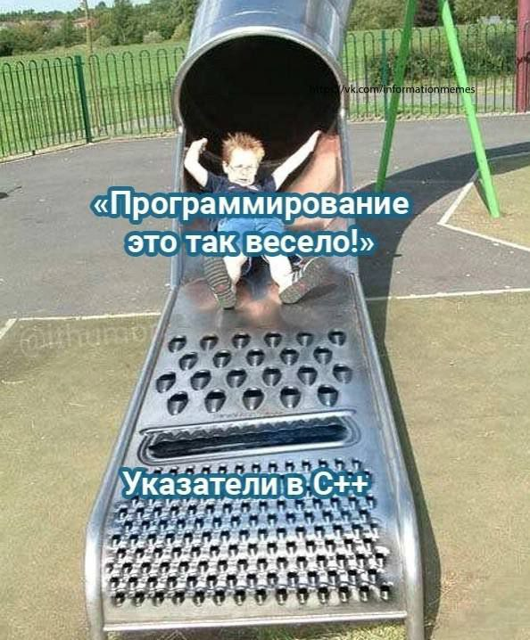

# VMK-20
Архив работ по объектноориентированному программированию за 2 курс.

`Фролова Анастасия`

- [Страница курса](https://github.com/VetrovSV/OOP)
- [Задания (прогр.) по ООП](https://raw.githubusercontent.com/VetrovSV/OOP/master/%D0%9E%D0%9E%D0%9F.%20%D0%97%D0%B0%D0%B4%D0%B0%D0%BD%D0%B8%D1%8F%20I.pdf)
- [Ведомость](https://docs.google.com/spreadsheets/d/1HYFkxtTxYqXsZASsX_ZGsDWGBvevukQZhHgS5r-YzW4/edit#gid=0)

# Важные коснспекты!!!
- [git](https://github.com/fakokk/abstracts_oop/blob/main/git.md)
- [принципы ооп](https://github.com/fakokk/abstracts_oop/blob/main/oop.md)

## 3 семестр
1. [inc. guard](https://github.com/fakokk/abstracts_oop/blob/main/1.%20inc%20guard.md)
2. [enum](https://github.com/fakokk/abstracts_oop/blob/main/2.%20enum.md)
3. [static](https://github.com/fakokk/abstracts_oop/blob/main/3.%20statiс.md)
4. [string](https://github.com/fakokk/abstracts_oop/blob/main/4.%20string.md)
5. [этапы компиляции](https://github.com/fakokk/abstracts_oop/blob/main/5.%20этапы%20компиляции.md)
6. [отладка в VS](https://github.com/fakokk/abstracts_oop/blob/main/6.%20отладка%20в%20VS.md)
7. [умные указатели](https://github.com/fakokk/abstracts_oop/blob/main/7.%20smart_pointer.md)
8. [rvalue, lvalue](https://github.com/fakokk/abstracts_oop/blob/main/8.%20rvalue_lvalue.md)
9. [c++ mind map](https://github.com/fakokk/abstracts_oop/blob/99371fbbe03905021fa511165ebaeeeea469950f/Course%20Syllabus-Course%20Syllabus.png)//возможно не исправлены какие-то ошибки

## 4 семестр

1. [dictionary](https://github.com/fakokk/abstracts_oop/edit/main/dictionary.md)
2. [regex](https://github.com/fakokk/abstracts_oop/blob/main/regex.md)

